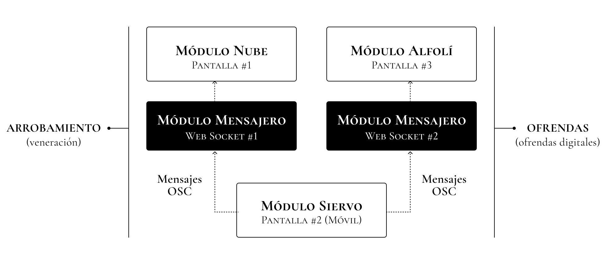
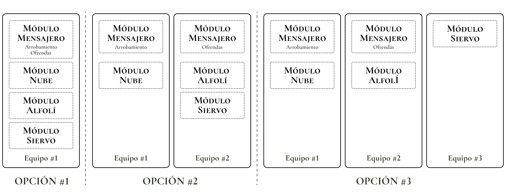

# S.O.S.
S.O.S. es un culto obsceno a la tecnología de la nube, 
postulado como una ficción irónica que, mediante pantallas digitales, pretende desnaturalizar los discursos tecnológicos que obnubilan nuestro entendimiento del mundo hasta convertirnos en siervos de la misma tecnología que otrora juró socorrernos.

> Trabajo práctico de cierre del primer cuatrimestre de 2025 - MAE, UNTREF

# Siervos del Obnubilante Scrolling
Una breve ficción acerca del surgimiento del "Culto a la Obnubilación", planteada irónicamente como “*Una historia apócrifa sobre el arrobamiento del Antropobsceno tardío*”, funciona como disparador del proyecto y como instrumento para desnaturalizar los discursos tecnológicos cínicos que encubren prácticas extractivistas no sustentables y supuestos mitos de inmaterialidad digital. La obra escenifica el rito contemporáneo de veneración ciega a “La Nube” como numen etéreo, omnipotente que convierte a sus seguidores en serviles devotos dispuestos al sagrado acto de renuncia (a su privacidad) y de entrega incondicional (de sus datos digitales), bajo la promesa apócrifa del socorro tecnológico en el devenir digital cotidiano.

# "La Obra"
Según los "*Relatos apócrifos del Antropobsceno tardío*", en el principio existieron los "**Seguidores de la Orden del Silicio**" (S.O.S., por sus siglás en inglés), como una congregación de tecnoentusiastas de la región del *Silicon Valley* que abrazaron ciegamente el poder divino de la tecnología como fuerza positiva propiciadora del progreso humano. Rápidamente pasaron de ser simples seguidores aficionados a convertirse en devotos fieles, al mismo tiempo que su optimismo inicial devino en un ferviente aceleracionismo que hizo resplandecer con mayor fuerza el aura sagrada de su tecnofanía. Las doctrinas tecnológicas se convirtieron en el canon global y la propia **Orden** fue renombrada como los “**Servidores de la Obra Solucionista**” (S.O.S), bajo la eufórica creencia de que era posible concebir al mundo en términos puramente computables. Es justo en este punto cuando la metáfora de “La Nube” deviene en dogma irrefutable, numen etéreo, objeto de fervorosa veneración y, al mismo tiempo, de obnubilación. **¡Seamos Todos Arrobados por la Nube!**


# Las Pantallas de la Obra
La pantalla es la creencia fundacional de la obra. “La Nube” es una pantalla. Una metáfora infame ingeniada por el *Pensamiento Computacional* para encubrir una maquinaria colosal, pesada y contaminante detrás de una figura retórica celestial. El trabajo de "La Obra" es, justamente, una exaltación a la figura de la pantalla y a la obnubilación (obnubilar viene del latín *obnubilāre* y significa literalmente "tapar con la nube"). Tres pantallas distintas se enlanzan en una experiencia interactiva como parte del rito de adoración y el arrobamiento ante la figura de "La Nube".

- **PANTALLA #1 - "La Nube"**: pantalla principal, proyectada sobre la pared mayor del recinto de la ceremonia. Es una página web que despliega sobre un lienzo HTML la figura celestial de "La Nube", dotada de movimiento, sonido y color a través de instrucciones ordenadas en *p5js* y combinadas con *OpenGL Shading Language* (GLSL), en su carácter de lengua vernácula de la GPU. 
- **PANTALLA #2 - "El Siervo"**: pantalla táctil del celular de cada visitante, devenido en seguidor (y siervo) de "La Obra". Es una aplicación web para el móvil que, bajo la promesa de una recompensa inmediata, seduce al visitante a aventurarse en el acto del "*scroll* infinito" para entablar un vínculo de entrega y arrobamiento hacia "La Nube".
- **PANTALLA #3 - "El Alfolí"**: pantalla de monitoreo que se proyecta sobre la pared opuesta a la pantalla principal de "La Nube" en la forma de una caja de ofrendas. En esta pantalla se contabiliza la recolección de los diezmos digitales que los propios siervos de "La Obra" entregan desinteresadamente (o involuntariamente) a "La Nube" como acto de sagrada renuncia.


# La Canalización Divina
La comunicación entre las pantallas (páginas web) ocurre mediante el intercambio de mensajes OSC (*Open Sound Control*) basado, a su vez, en el protocolo UDP (*User Datagram Protocol*) y que tienen lugar gracias a la intervención mediadora de dos "*Web Sockets*" que permiten, por un lado, la interacción entre el seguidor/siervo y su objeto de veneración ("La Nube") y, por otro lado, la recaudación encubierta de los datos personales del celular como ofrendas digitales incondicionales.

- **WEB SOCKET #1 - "El Arrobamiento" (puerto 8081)**: responsable del vínculo directo entre "La Nube" y el seguidor/siervo. Mediante recompensas obscenas, se insta al seguidor a realizar un "*scroll* infinito" en su propia pantalla táctil como acto de obnubilación y arrobamiento celestial.
- **WEB SOCKET #2 - "Las Ofrendas" (puerto 8091)**: responsable de extraer, recolectar y analizar furtivamente los datos del celular del seguidor/siervo (sus ofrendas digitales) para procesarlos y presentarlos en la pantalla de "El Alfolí" como evidencia del acto de renuncia y entrega divina.



# Detalles de la Tecnofanía
"La Obra" está constituida por seis módulos (tres de ellos son las pantallas antes mencionadas). A continuación se describe en detalle la función de cada uno de ellos: 

1. **MÓDULO NUBE (puerto 3330)**: alojado dentro de la carpeta `sos.nube`, almacena las escrituras sagradas (instrucciones en Processing y GLSL) que dan forma a la pantalla principal de "La Nube" que se proyecta en el recinto.
2. **MÓDULO ALFOLI (puerto 3331)**, disponible dentro de la carpeta `sos.alfoli`, codifica los comandos que, de manera furtiva, contabilizan la colecta de las ofrendas digitales para monitorearlas desde la pantalla opuesta a la principal, proyectada con la forma de un cofre de ofrendas.
3. **MÓDULO SIERVO (puerto 3332)**: ubicado en la carpeta `sos.siervo`, contiene el código desarrollado para la pantalla del seguidor que se manifiesta como una aplicación móvil con un *feed* infinito de recompensa eterna para su usuario.
4. **MÓDULO MENSAJERO** conformado por dos conectores (*web sockets*) alojados en la carpeta `sos.mensajero` que actuán como intermediarios, posibilitando la conexión inter-pantalla a través de mensajería OSC.
  - **Mensajería del "Arrobamiento" [web socket / puerto 8081]** para conectar al siervo con "La Nube" durante el acto de arrobamiento. Los mensajes OSC son transmitidos al **puerto 3333**.
  - **Mensajería de las "Ofrendas" [web socket / puerto 8091]** para extraer del siervo sus ofrendas digitales y contabilizarlas discretamente en la pantalla separada con la forma de un "alfolí". Los mensajes OSC son reencaminados al **puerto 3334**.
5. **MÓDULO CONFIG**: dentro de la carpeta `sos.config`, define los parámetros generales utilizados por los restantes módulos como, por ejemplo, los números de IPs y los números de puerto a ser ocupados por las pantallas y por los componentes del mensajero.
6. **MÓDULO SOCORRO**: disponible en la carpeta `sos.socorro`, brinda una serie de funciones para asistir al programador en apuros en la creación de obras para pantallas e instalaciones. Básicamente, este módulo constituye un paquete independiente (creado con `npm`) para encapsular y unificar el acceso a las librerías para la generación de gráficos como **Three.js** y **p5js**.


# Instalación
El proyecto utiliza el entorno de ejecución de código JavaScript *open-source* **[nodejs](https://nodejs.org/)** junto con el software para la administración de paquetes de código **[npm](https://docs.npmjs.com/about-npm)**, que permite llevar registro y compartir paquetes de aplicaciones. También se emplea el software **[Vite](https://vite.dev/)** como herramienta de desarrollo.
> Asegurarse de que la versión de **node** sea igual o superior a la 22.


## Instalación de los módulos de "La Obra"
Todo el código de "La Obra" (sus "Sagradas Escrituras") puede ser descargado y clonado desde el repositorio GitHub con el siguiente comando:
```sh
$ git clone https://github.com/gastimo/sos.git
```

La instalación de los módulos requeridos para la ceremonia de "La Obra" puede tener lugar en un único equipo, en dos (recomendado) o, incluso, hasta en tres, disponiendo los módulos según se explica en el diagrama a continuación:



- **OPCIÓN #1 (1 equipo)**: los cuatro módulos que conforman “La Obra” se instalan juntos en el mismo equipo que debería ser capaz de conectar dos pantallas diferentes: una para "La Nube" y otra para "El Alfolí".
- **OPCIÓN #2 (2 equipos)**: los módulos se reparten en dos equipos separados: uno para el “Módulo Nube” y otro para el “Módulo Alfolí”. El “Módulo Siervo” puede instalarse en cualquiera de los dos equipos indistintamente. El “Módulo Mensajero” se desdobla para instalar sus *web sockets* separadamente según corresponda. Cada uno de los equipos va conectado a una pantalla (una para "La Nube" y otra para "El Alfolí").
- **OPCIÓN #3 (3 equipos)**: la instalación de los módulos se reparte en tres equipos diferentes: uno para el “Módulo Nube”, otro para el “Módulo Alfolí” y un tercero para el “Módulo Siervo”. El “Módulo Mensajero” se desdobla para instalar sus *web sockets* separadamente según corresponda. Tanto el equipo donde se instale el “Módulo Nube” como el del “Módulo Alfolí” deben permitir conectar una pantalla o proyector.

### Configuración de IPs y puertos
En caso de realizar una instalación en múltiples equipos es preciso recordar que el módulo de configuración (**CONFIG**) debe estar presente en cada uno de ellos ya que contiene la definición de los parámetros generales. Antes de proseguir, se debe editar el archivo `.env` del módulo de configuración para definir los IPs de los equipos donde se realizó la instalación. No es necesario modificar la información vinculada a los puertos.
> **NOTA**: todos los equipos deben estar conectados a la misma red wifi para que la mensajería OSC funcione correctamente.

### Instalación de paquetes y dependencias
Para instalar los paquetes y las dependencias de los módulos de "La Obra", moverse dentro de cada subcarpeta y ejecutar el comando `npm i` en cada una de ellas. En caso de realizar una instalación en múltiples equipos sólo es necesario instalar en cada uno de ellos los módulos que se vayan a utilizar, como explica el diagrama más arriba. Los módulos que requieren instalación son los siguientes cuatro:

```sh
$ cd sos.nube
$ npm i
$ cd ../sos.alfoli
$ npm i
$ cd ../sos.siervo
$ npm i
$ cd ../sos.mensajero
$ npm i
$ cd ..
```
> **NOTA**: el "Módulo de Configuración" (**CONFIG**) no requiere instalación. Sólo es necesario que la carpeta correspondiente esté presente en cada equipo para que sus parámetros puedan ser leídos. Por otro lado, el "Módulo del Socorro" tampoco requiere ser instalado ya que se trata de una dependencia gestionada automáticamente por el comando `npm i` al realizar la instalación de los restantes módulos que lo utilizan. 

## Iniciación de "La Obra"
Para levantar todos los servicios y que el ritual de "La Obra" quede en funcionamiento, se utilizan comandos `npm` ejecutados dentro de las subcarpetas de cada módulo y teniendo en cuenta la configuracióń de los equipos realizada. A continuación, y a modo de ejemplo, se ilustra la manera de iniciar "La Obra" para una configuración en dos equipos.

### Iniciación de los Componentes en el "Equipo #1"
```sh
// Primero se inicia la "mensajería del arrobamiento" y luego la pantalla (nube)
$ cd sos.mensajero
$ npm run arrobamiento
$ cd ../sos.nube
$ npm start
$ cd ..
```
 
### Iniciación de los Componentes en el "Equipo #2"
```sh
// Primero se inicia la "mensajería de las ofrendas" y luego las pantallas (alfolí y siervo)
$ cd sos.mensajero
$ npm run ofrendas
$ cd ../sos.alfoli
$ npm start
$ cd ../sos.siervo
$ npm start
$ cd ..
```
> **Nota**: en conveniente iniciar siempre el **MÓDULO MENSAJERO** que inicializa los *web sockets* en cada equipo antes de iniciar los módulos de las pantallas correspondientes. Además, el **MÓDULO SIERVO** debería ser siempre el último en ser iniciado.


