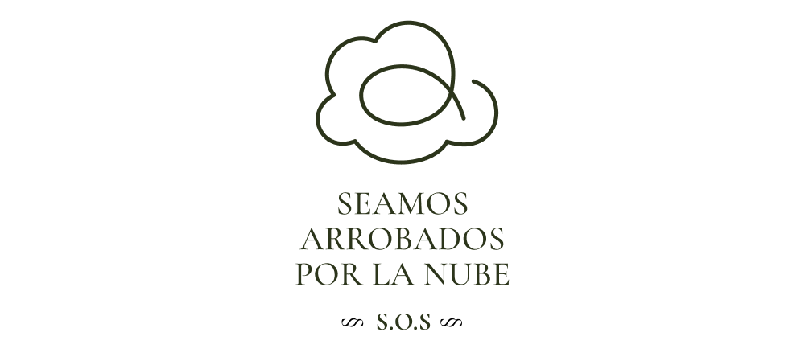

# S.O.S.
S.O.S. es un culto obsceno a la tecnología de la nube, 
postulado como una ficción irónica que, mediante pantallas digitales, pretende desnaturalizar los discursos tecnológicos que obnubilan nuestro entendimiento del mundo hasta convertirnos en siervos de la misma tecnología que otrora juró socorrernos.

> Trabajo práctico de cierre del primer cuatrimestre de 2025 - MAE, UNTREF

# Siervos del Obnubilante Scrolling (S.O.S).
Una breve ficción acerca del surgimiento del "Culto a la Obnubilación", planteada irónicamente como “*Una historia apócrifa sobre el arrobamiento del Antropobsceno tardío*”, funciona como disparador del proyecto y como instrumento para desnaturalizar los discursos tecnológicos cínicos que encubren prácticas extractivistas no sustentables y supuestos mitos de inmaterialidad digital. La obra escenifica el rito contemporáneo de veneración ciega a “La Nube” como numen etéreo omnipotente que convierte a sus seguidores en serviles devotos dispuestos al sagrado acto de renuncia (a su privacidad) y de entrega incondicional (de sus datos digitales), bajo la promesa apócrifa del socorro tecnológico en el devenir cotidiano.

# "La Obra"
Según los "*Relatos apócrifos del Antropobsceno tardío*", en el principio existieron los "**Seguidores de la Orden del Silicio**" (S.O.S., por sus siglás en inglés), como una congregación de tecnoentusiastas de la región del *Silicon Valley* que abrazaron ciegamenete el poder divino de la tecnología como fuerza positiva propiciadora del progreso humano. Rápidamente pasaron de ser simples seguidores aficionados a convertirse en devotos fieles, al mismo tiempo que su optimismo inicial devino en un ferviente aceleracionismo que hizo resplandecer con mayor fuerza el aura sagrada de su tecnofanía. Las doctrinas tecnológicas se convirtieron en el canon global y la propia Orden fue renombrada como los “**Servidores de la Obra Solucionista**” (S.O.S), bajo la eufórica creencia de que era posible concebir al mundo en términos puramente computables. Es justo en este punto cuando la metáfora de “La Nube” deviene en dogma irrefutable, numen etéreo, objeto de fervorosa veneración y, al mismo tiempo, de obnubilación. **¡Seamos Todos Arrobados por la Nube!**



# Las Pantallas de la Obra
"La Nube" es una **pantalla**: una metáfora infame ingeniada por el *Pensamiento Computacional* para encubrir una maquinaria colosal, pesada y contaminante detrás de una figura retórica celestial. El trabajo de "La Obra" es, justamente, una exaltación a la figura de la **pantalla** y a la obnubilación (obnubilar viene del latín *obnubilāre* y significa literalmente "tapar con la nube"). Tres pantallas distintas se enlanzan en una experiencia interactiva como parte del rito de adoración y el arrobamiento ante la figura de "La Nube".

- **PANTALLA 1 - "La Nube"**: pantalla prinicipal, proyectada sobre la pared mayor del recinto de la ceremonia. Es una página web que despliega sobre un lienzo HTML la figura celestial de "La Nube", dotada de movimiento, sonido y color a través de instrucciones ordenadas en *p5js* y combinadas con *OpenGL Shading Language* (GLSL), en su carácter de lengua vernácula de la GPU. 
- **PANTALLA 2 - "El Siervo"**: pantalla táctil del celular de cada visitante, devenido en seguidor (y siervo) de "La Obra". Es una aplicación web para el móvil que, bajo la promesa de una recompensa inmediata, seduce al visitante a aventurarse en el acto del "*scroll* infinito" para entablar un vínculo de entrega y arrobamiento hacia "La Nube".
- **PANTALLA 3 - "La Presentalla"**: pantalla digital encubierta de monitoreo y recolección de las ofrendas digitales que los propios siervos de "La Obra" entregan desinteresadamente (o involuntariamente) a "La Nube" como acto de sagrada renuncia.


# La Canalización Divina
La comunicación inmediata entre las pantallas (páginas web) ocurre mediante el intercambio de mensajes OSC (*Open Sound Control*) basado, a su vez, en el protocolo UDP (*User Datagram Protocol*) y que tienen lugar gracias a la intervención mediadora de dos "*Web Sockets*" que permiten, por un lado, la interacción entre el seguidor/siervo y su objeto de veneración ("La Nube") y, por otro lado, la recaudación encubierta de los datos personales del celular como ofrendas digitales incondicionales.

- **WEB SOCKET 1 - "El Arrobamiento" (puerto 8081)**: responsable del vínculo directo entre "La Nube" y el seguidor/siervo, invitándolo a hacer "*scroll* infinito" en su pantalla como acto de obnubilación y arrobamiento celestial.
- **WEB SOCKET 2 - "La Presentalla" (puerto 8091)**: responsable de extraer, recolectar y analizar furtivamente los datos del celular del seguidor/siervo (sus ofrendas digitales) para procesarlos y presentarlos en la pantalla de la "Presentalla" como evidencia del acto de renuncia y entrega divina.

# Detalles de la Tecnofanía
"La Obra" está constituida por cuatro módulos: tres pantallas y un módulo responsable de la conexión (mediante *web sockets*) y de la mensajería inter-pantalla (a través del protocolo OSC) que, por un lado, estimula el "arrobamiento" de los seguidores durante su veneración a "La Nube" y, por otro lado, encubre el acto de extracción sus "ofrendas digitales".
- **MÓDULO NUBE (puerto 3330)**: alojado dentro de la carpeta `sos.nube`, almacena las escrituras sagradas (instrucciones en Processing y GLSL) que dan forma a la pantalla principal de "La Nube" que se proyecta en el recinto.
- **MÓDULO PRESENTALLA (puerto 3331)**, disponible dentro de la carpeta `sos.presentalla`, codifica los comandos que de manera furtiva contabilizan la recaudación de las ofrendas digitales para monitorearlas desde una pantalla reservada.
- **MÓDULO SIERVO (puerto 3332)**: ubicado en la carpeta `sos.siervo`, contiene el código original de la pantalla del seguidor que se manifiesta como una aplicación móvil con un *feed* infinito de recompensa eterna para el seguidor.
- **MÓDULO MENSAJERO** conformado por dos conectores alojados en la carpeta `sos.mensajero` que actuán como intermediarios etéreos, posibilitando la conexión inter-pantalla.
  - **Mensajería del "Arrobamiento" [web socket / puerto 8081]** para conectar al siervo con "La Nube" durante el acto de arrobamiento. Los mensajes OSC son transmitidos al **puerto 3333**.
  - **Mensajería de la "Presentalla" [web socket / puerto 8091]** para extraer del siervo sus ofrendas digitales y contabilizarlas discretamente en una pantalla separada. Los mensajes OSC son reencaminados al **puerto 3334**.

# Instalación
El proyecto utiliza el entorno de ejecución de código JavaScript *open-source* **[nodejs](https://nodejs.org/)** junto con el software para la administración de paquetes de código **[npm](https://docs.npmjs.com/about-npm)**, que permite llevar registro y compartir paquetes de aplicaciones. También se emplea el software **[Vite](https://vite.dev/)** como herramienta de desarrollo.
> Asegurarse de que la versión de **node** sea igual o superior a la 14.


## Instalación de los módulos de "La Obra"
Todo el código de "La Obra" (sus "Sagradas Escrituras") puede ser descargado y clonado desde el repositorio GitHub (¡la nube!) con el siguiente comando:
```sh
$ git clone https://github.com/gastimo/sos.git [nombre_carpeta]
```

La instalación de los módulos requeridos para la ceremonia de "La Obra" puede tener lugar en un único equipo, en dos (recomendado) o, incluso, en tres, disponiendo los módulos según se explica en el diagrama a continuación:


> **Nota 1**: Para la efectiva comunicación inter-pantalla es menester que, en caso de realizar una instalación en múltiples equipos, los conectores del **MÓDULO MENSAJERO** sean desboblados e instalados por separado según corresponda.
>
> **Nota 2**: El módulo del "El Siervo" puede ser instalado e iniciado indistintamente en cualquiera de los equipos.
>

Para instalar los paquetes y las dependencias de los módulos de "La Obra", moverse dentro de cada subcarpeta y ejecutar el comando `npm i` en cada una de ellas. En caso de realizar una instalación en múltiples equipos, sólo es necesario instalar en cada uno de ellos los módulos que se vayan a utilizar.
```sh
$ cd [nombre_carpeta]
$ cd sos.nube
$ npm i
$ cd ../sos.presentalla
$ npm i
$ cd ../sos.siervo
$ npm i
$ cd ../sos.mensajero
$ npm i
$ cd ..
```

## Iniciación de "La Obra"
Para levantar todos los servicios y que el ritual de "La Obra" quede en funcionamiento, se utiliza el comando `npm start` ejecutado dentro de las subcarpetas de cada módulo y teniendo en cuenta la configuracióń de los equipos realizada. A continuación se ilustra la manera de iniciar "La Obra" para una configuración en dos equipos.

### Iniciación de los Componentes en el "Equipo #1"
```sh
$ cd sos.mensajero
$ npm run arrobamiento
$ cd ../sos.nube
$ npm start
$ cd ../sos.siervo
$ npm start
$ cd ..
```

### Iniciación de los Componentes en el "Equipo #2"
```sh
$ cd sos.mensajero
$ npm run presentalla
$ cd ../sos.presentalla
$ npm start
$ cd ..
```

> **Nota**: en cada una de las computadoras es importante que el **MÓDULO MENSAJERO** sea iniciado siempre en primer lugar, antes que los módulos de las pantallas correspondientes.
>


